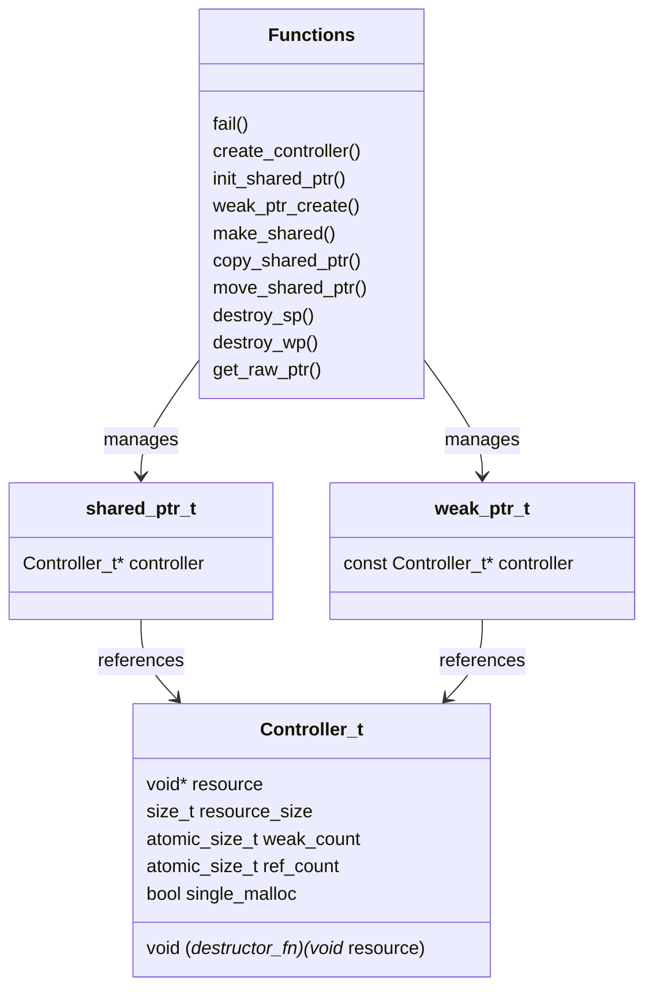

# C Smart Pointer Library

A thread-safe implementation of smart pointers in C, providing reference-counted memory management with shared and weak pointer semantics.

## Features

- Reference counting with atomic operations for thread safety
- Shared pointer implementation (`shared_ptr_t`)
- Weak pointer support (`weak_ptr_t`)
- Memory leak prevention through automatic cleanup
- Support for custom destructors
- Thread-safe operations using atomic counters

## Design Structure



## Requirements

- C11 or later
- POSIX-compliant system
- GCC or Clang compiler

## Building

```bash
# Regular build
make all

# Development build with Address Sanitizer
make dev
```

## Usage

### Basic Usage

```c
typedef struct MyStruct {
    int* data;
    size_t size;
} MyStruct_t;

void my_destructor(void* resource) {
    MyStruct_t* ms = (MyStruct_t*)resource;
    free(ms->data);
}

// Create a shared pointer
shared_ptr_t* sp = make_shared(sizeof(MyStruct_t), my_destructor);
MyStruct_t* ms = (MyStruct_t*)get_raw_ptr(sp);

// Use the resource
ms->data = malloc(100 * sizeof(int));
ms->size = 100;

// Create another reference
shared_ptr_t* sp2 = copy_shared_ptr(sp);

// Create a weak reference
weak_ptr_t* wp = weak_ptr_create(sp);

// Cleanup
destroy_sp(sp2);
destroy_sp(sp);
destroy_wp(wp);
```

### API Reference

#### Shared Pointer Operations
- `make_shared`: Create a shared pointer with single allocation
- `init_shared_ptr`: Create a shared pointer with split allocation
- `copy_shared_ptr`: Create a new reference to existing shared pointer
- `move_shared_ptr`: Transfer ownership to a new shared pointer
- `destroy_sp`: Decrease reference count and cleanup if last reference
- `get_raw_ptr`: Access the managed resource

#### Weak Pointer Operations
- `weak_ptr_create`: Create a weak reference to a shared pointer
- `destroy_wp`: Cleanup weak pointer reference

## Testing

The library includes a comprehensive test suite. Run tests with:

```bash
make dev  # Builds with Address Sanitizer
```

## Project Structure

```
.
├── src/
│   ├── include/
│   │   ├── smart_ptr.h    # Public API
│   │   └── debug.h        # Debug utilities
│   └── smart_ptr.c        # Implementation
├── tests/
│   ├── include/
│   │   └── unittest.h     # Test framework
│   └── smart_ptr_tests.c  # Test suite
└── Makefile
```

## Debugging

The library includes a comprehensive debugging system with:
- Error logging macros
- Memory checking support
- Address Sanitizer integration in dev build
- Debug information preservation

## Known Limitations

- No automatic type safety (C limitation)
- Cannot prevent access to underlying resource through weak pointers (C limitation)
- Manual memory management still required for resource data

## License

This project is licensed under the MIT License - see the LICENSE file for details.
