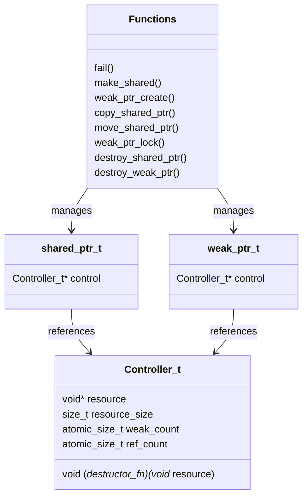

# C Smart Pointer Library

A thread-safe implementation of smart pointers in C, providing reference-counted memory management with shared and weak pointer semantics.

## Features

- Shared pointer implementation with automatic reference counting
- Weak pointer support
- Thread-safe operations using atomic counters
- Custom resource destruction support
- Memory leak prevention through automatic cleanup

## Design Structure



## Usage Example

```c
// Define a destructor for your resource
void my_destructor(void* resource) {
    // Cleanup logic here
    free(resource);
}

// Create a shared pointer
shared_ptr_t* sp = init_shared_ptr(sizeof(int), my_destructor);

// Use the resource
int* data = (int*)sp->controller->resource;
*data = 42;

// Create another reference
shared_ptr_t* sp2 = copy_shared_ptr(sp);

// Create a weak reference
weak_ptr_t* wp = weak_ptr_create(sp);

// Cleanup
destroy_sp(sp);
destroy_sp(sp2);
destroy_wp(wp);
```
## Usage Example with Dynamic Array (Recommended Approach Using make_shared)

```c
// Structure holding a dynamic array
typedef struct Array {
    int* data;
    size_t size;
} Array;

// Custom destructor for Array
void array_destructor(void* resource) {
    Array* arr = (Array*)resource;
    free(arr->data);  // Free the dynamic array
}

int main() {
    // Create shared pointer to Array structure
    shared_ptr_t* array_sp = make_shared(sizeof(Array), array_destructor);
    
    // Initialize the array
    Array* arr = (Array*)array_sp->controller->resource;
    arr->size = 100;
    arr->data = malloc(arr->size * sizeof(int));
    
    // Use the array
    for (size_t i = 0; i < arr->size; i++) {
        arr->data[i] = i;
    }

    // Share ownership in another function or thread
    shared_ptr_t* worker_ref = copy_shared_ptr(array_sp);
    
    // When done, cleanup
    destroy_sp(array_sp);
    destroy_sp(worker_ref);

    return 0;
}
```

## Dependencies

- C11 or later (for `stdatomic.h`)
- Standard C library

## Best Practices

1. Always pair initialization with destruction
2. Use move semantics when transferring ownership
3. Prefer `make_shared` over `init_shared_ptr` for better performance
4. Implement proper destructor functions for managed resources
5. Check return values for NULL when creating new pointers

## Building

Include `lib.h` and link against `lib.c` in your project. Ensure you're compiling with C11 or later standard support.

```bash
gcc -std=c11 -c lib.c
```


