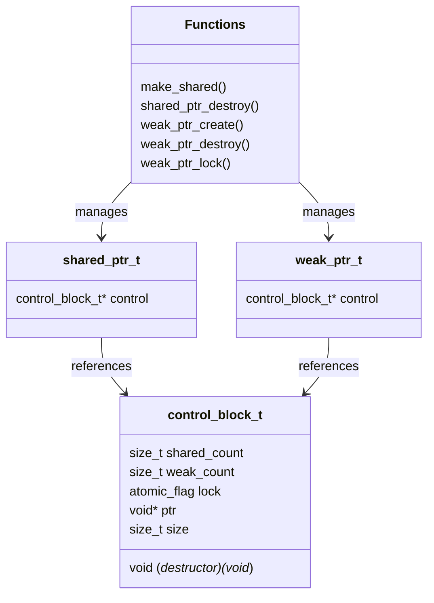

# Thread-Safe Smart Pointer Implementation in C

A lightweight implementation of reference-counted smart pointers with thread safety, similar to C++'s `std::shared_ptr` and `std::weak_ptr`.

## Features

- Thread-safe reference counting using spinlocks
- Memory-efficient single allocation with `make_shared`
- Support for custom destructors
- Weak pointer support to break reference cycles
- Optimized struct layout for better memory usage

## Design Structure



## Usage Example

```c
// Create a shared pointer
shared_ptr_t* sp = make_shared(sizeof(Resource), resource_destructor);

// Create a weak reference
weak_ptr_t* wp = weak_ptr_create(sp);

// Clean up
shared_ptr_destroy(sp);
weak_ptr_destroy(wp);
```

## Building

```bash
make
```

## Notes

- Uses C11 features (`stdatomic.h`)
- Optimized for single-allocation pattern with `make_shared`
- Thread-safe operations using spinlocks
- Memory efficient control block design

## License

